# Instrucciones para el Kit BigData
---

La idea de este taller, es ofrecer una introducción al algunos conceptos claves del BigData y, además
poder poner en práctica algunos de ellos en una breve puesta en marcha.

## Importante
---
Su máquina debe contar con los siguientes requisitos
- Mínimo 8GB de RAM, ideal 16GB o más
- Mínimo 20 GB de espacio libre en el disco
---
* El item de la memoria RAM es súper importante, quienes no tengan PC con esta cantidad, igual puede participar pero es probable que no puedan ejecutar todas las herramientas. 
---

## Virtual box
---
Virtual Box es una aplicación que permite virtualizar máquinas completas, incluyendo hardware y sistma operativo
 - Descargar virtual box desde aquí, https://www.virtualbox.org/wiki/Downloads (seleccione su S.O.)
 - Instalar

## Descargar Sandbox de Hortonworks
---
Hortonworks es una empresa que provee servicios de herramientas para BigData. Dentro de las cualidades que ofrece, es la de entregar
una version de un sistema operativo con todas las herramientas bases para poder iniciar un ecosistema de BigData. Algunos de los softwares incluidos están (los que ocuparemos en esta ocasión):
- Apache Hadoop 
- Apache Spark 2
- Apache Hive
- Apache Hadoop MapReduce
- Entre muchos otros más :)

Todos estos software corren bajo una infraestructura soportada por Centos 7 como S.O.
Si bien, en su gran mayoría casi todas las herramientas que se proveen son opensource, el negocio de la empresa, es entregar un sistema operativo out of the box (llegar y usar) con todas las herramientas ya pre configuradas y funcionando (realizar esto de manera independiente es bastante complejo). 

### Descargando el sandbox
---
 - Ir a https://hortonworks.com/downloads/#sandbox
    - En el primer ítem, donde dice "Hortonworks Data Platform (HDP®) 2.6.3 on Hortonworks Sandbox" , seleccionar Download for VirtualBox
    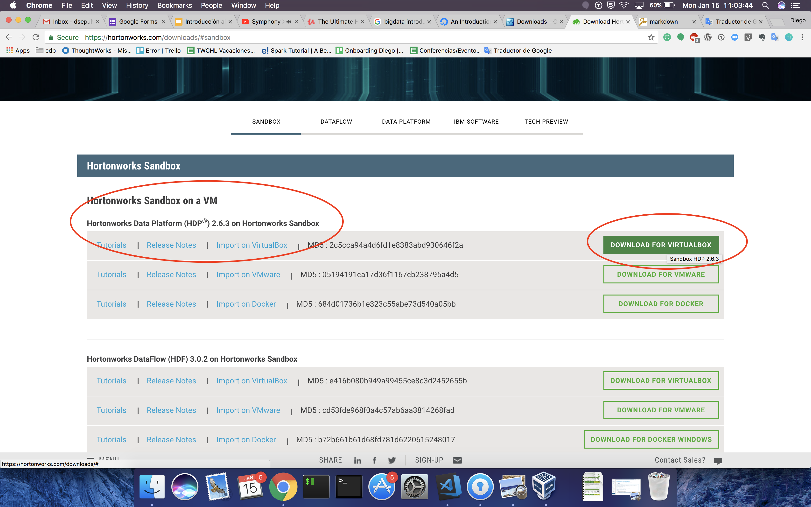
    - Completar el formulario
    - Esperar que descargue, son aproximadamente 10 GB, asi que puede demorar un poco.

### Cargando la imagen de Hortonworks en VirtualBox
---
1. Abrir VirtualBox
2. Ir al menú **File** -> **Import Appliance** (primer ítem)
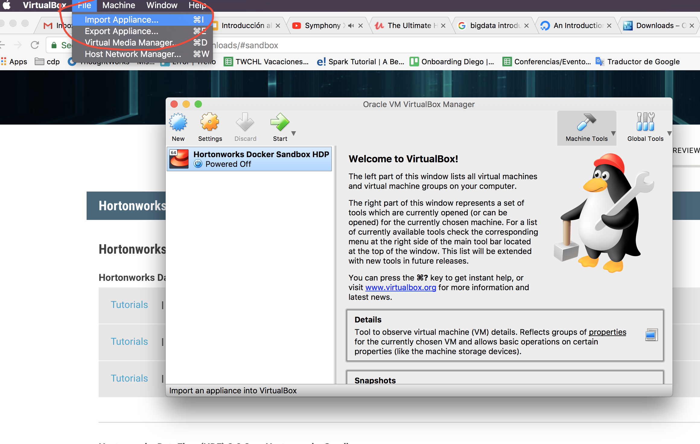
3. En la ventana que desplegó, buscar la imágen descargada (generalmente puede quedar en la carpeta de **Downloads**, a menos que hayan configurado su navegador para que guarde las descargas en otro destino)
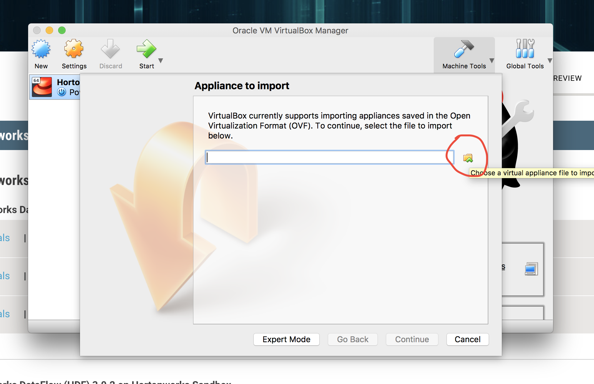
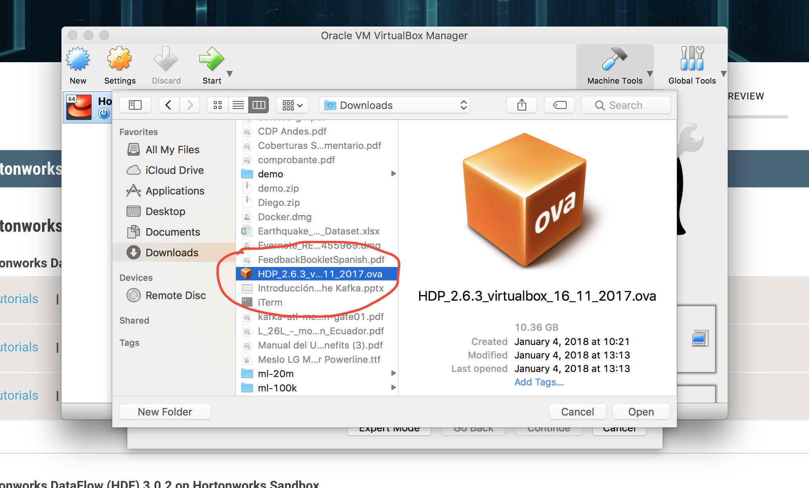
4. Presione **Open** y luego presionar **Continue**
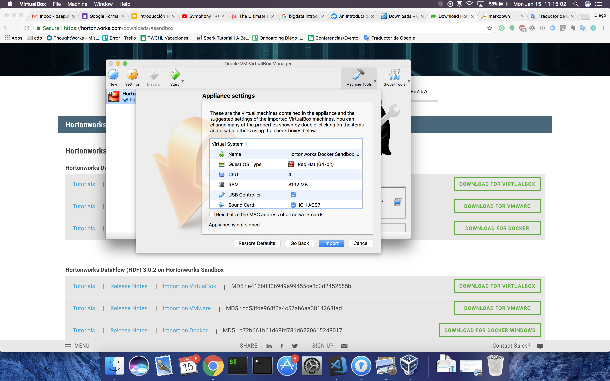
5. Y Luego presionar **Import**
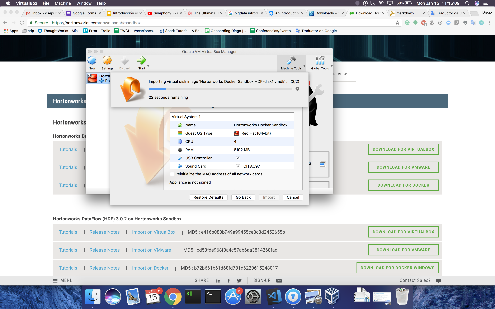
Esto puede tomar unos minutos, sólo hay que esperar.
6. Finalmente, el resultado será la imágen importada dentro de VB disponible para si ejecución.
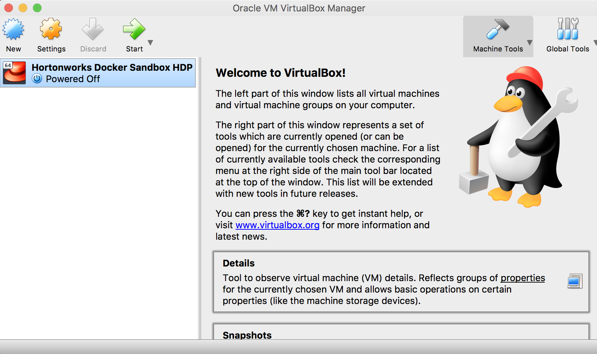

### Ejecutando la imágen
---

Para ejecutar el sandbox de Hortonworks, se debe hacer doble click en la imágen previamente cargada

Y se abrirá la siguiente pantalla, en la cual hay que **esperar** a que todo cargue (esto puede tomar unos minutos dependiendo de las características de su PC)
1. 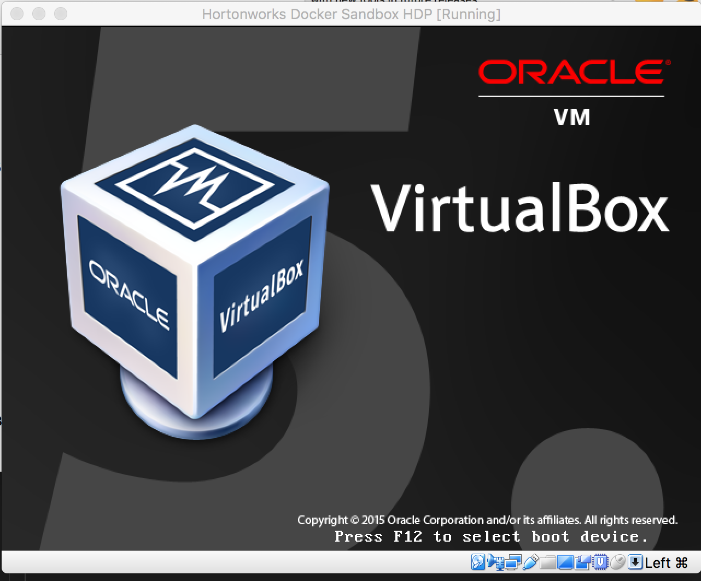
2. 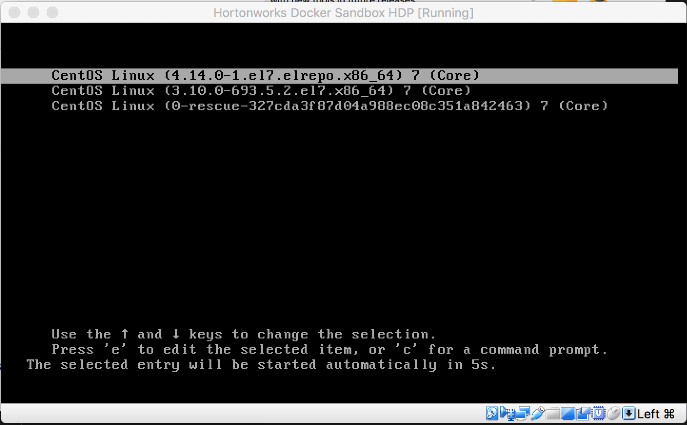
3. 
Ésto tomará algunos minutos en cargar.
4. Esta es la imágen que se mostrará cuando se haya terminado de cargar todo correctamente.
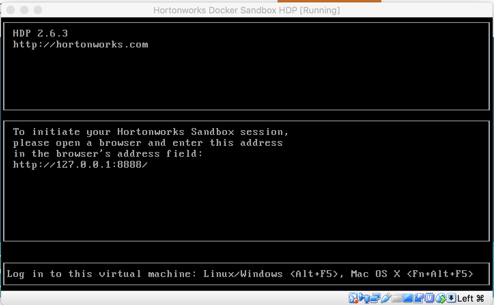

### Abriendo la consola de administración
---
1. En su navegador favorito entrar a http://127.0.0.1:8080 usando las credenciales
 - User: maria_dev
 - Pass: maria_dev
2. Y debe mostrar esta imágen
 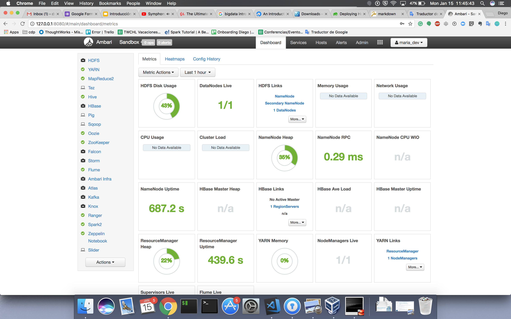

## Descargando el Dataset a ocupar
---
Bajen el contenido de este link
http://files.grouplens.org/datasets/movielens/ml-100k.zip

## Y listo
---
Y ya está todo listo para poder comenzar a trabajar. :)
